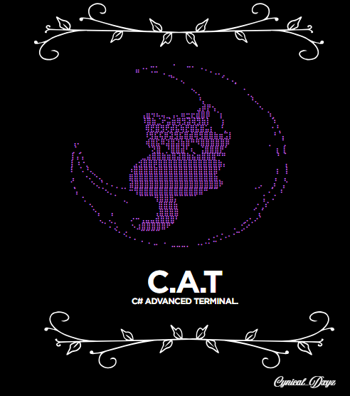

# C# Advanced Terminal
<small><i>"If Bash and PowerShell had a kid."</i></small>

Copyright (c) 2025 lunaNoir | MIT License | [[LICENSE.txt]]

Welcome to C# Advanced Terminal (or CAT for short), as the name suggests, it's a shell entirely written in C#, leveraging the uses of the .NET Framework.

## What is CAT?
<small><i>"First impressions are always the best impressons."</i></small>

CAT - authored by lunaNoir - is an open-source, cross-platform shell written in C# and the .NET Framework designed for general use, and power-users alike. What makes it unique compared to other traditional shells is that it has custom "plugins" called bundles written in C# and dynamically imported by CAT, used to write commands - yes, you read that right, you can write your own commands in C# as a bundle! No API needed!

<small>Fun fact, every base command in CAT (if installed with bundles) is managed by a bundle!</small>

## Who owns CAT?
<small><i>"The future is uncertain, unpredictable, as we shape it our way."</i></small>

That's the best part, no one! CAT is owned by the community, and the community only. Whilst lunaNoir did write the initial code, the future and shape of CAT are completely up to what the community does with it. CAT belongs to everyone who dares to improve it.

## Why should I use CAT?
<small><i>"Choice is important, it is as important as your intentions behind it."</i></small>

That choice is up to you, and what you do. Here are some reasons to try CAT:
- Loves Unix philosophies.
- Uniquely extensible.
- A scriptable environment that's both low-level and high-level.
- A DIY "developer operating environment."
- Portable, and self-contained.
- Nostalgic. (Don't ask where I got this from.)
- It's a platform, not just a shell.
- Because CAT is the best. (Yes, I took this straight out of Arch Linux.)

And a list of who CAT would catch the eye of:
- .NET Developers.
- Unix fans.
- Linux users.
- Ethical Hackers.
- Tool creators.
- Educators.
- System Managers.

## Why would I not want to use CAT?
<small><i>"Everything has pros and cons."</i></small>

CAT may not be for you if:
- You do not like the .NET Framework.
- You do not commonly use terminals and shells.
- You do not know what a shell or operating system is (and don't want to).
- You do not know what operating system you are using.
- You prefer usable shells straight out-of-the-box instead of a DIY environment.
- You're an Apple user, unless you're brave...
- You are happy with your current shell.

## How do I use CAT?
<small><i>"A guide isn't a guide if it's too broad, nor too specific."</i></small>

CAT isn't a traditional shell, its commands are handled through bundles, stored in your data folder. (Windows being `C:\Users\<user>\AppData\Roaming\CAT\bundles` and Linux being `~/.config/CAT/bundles`) which allows users to write their own commands. It's commands are also unique. Most of the common commands you'll most likely use can be ran exactly like normal commands, but some other commands - like some within the Fun bundle - follow a prefix.suffix system. The prefix is the bundle's name, the file name, and the suffix is the function within that bundle, the command. Example, let's say I had a bundle called `customBundle.cs`, within it had one function called `aCommand`. CAT dynamically compiles bundles into memory, and can be ran exactly by simply typing `custombundle.acommand`, do not worry, it is case-insensitive!

Bundles aren't the only thing, as like other shells, you can run from your PATH, meaning you can use all your favourite tools on CAT! Git, Python, dotnet, Vim, Nano, if it runs on other shells, it runs on CAT.

## How do I contribute to CAT?
<small><i>"A community isn't a community if no one can help."</i></small>

See the contribution guide. [[CONTRIBUTING.md]]

## Does CAT follow some Unix Philosophies?
<small><i>"What really is Unix? A family? A concept? An operating system? It is all."</i></small>

CAT follows a lot of Unix philosophies *spiritually*, not literally. Here's a dozen.

- "Do one thing, and do it well."
- "Write programs that work together."
- "Use text streams as the universal interface."
- "Build a prototype, then improve it."
- "Everything is a file."
- "Small tools, loosely joined."
- "Make every program a filter."
- "Store data in flat text files."
- "Clarity over cleverness."
- "Be transparent; let the user see what’s happening."
- "Avoid captive user interface."
- "Everything should be replaceable."

CAT doesn't literally follow these philosophies, but rather spiritually. It brings the Unix designs into a .NET environment.

## Q&A
<small><i>"Everyone always has questions, even if they say they don't."</i></small>

**Q: What does CAT stand for?**
A: C# Advanced Terminal.

**Q: Is CAT a replacement for Bash or PowerShell?**
A: No, it is an alternative tool, combining Bash and PowerShell together.

**Q: Does CAT use text streams or objects like PowerShell?**
A: Text streams.

**Q: How do I import bundles others have made?**
A: If a friend or a trusted person has sent you a .cs file for CAT, simply place it in your bundles directory. Windows: `C:\Users\<user>\AppData\Roaming\CAT\bundles`, Linux: `~/.config/CAT/bundles`.

**Q: What is Unix or Linux?**
A: This question does not belong here, but is worth learning.

**Q: What platforms does CAT run on?**
A: Anywhere .NET is, however, CAT has never been tested on macOS.

**Q: Why use CAT instead of a normal shell?**
A: CAT is a normal shell, but with a twist. Read the entire README file, then come back to here.

**Q: Is CAT Open-Source?**
A: Yes.

**Q: Can I embed CAT into my own tool, or have it come pre-installed with a modified operating system installation disk?**
A: Yes! 

